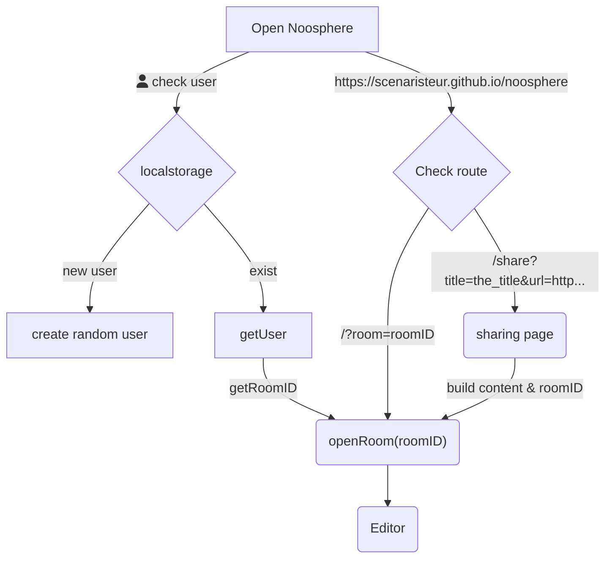

# noosphere

vue create noosphere
cd noosphere




---

[](https://mermaid-js.github.io/mermaid-live-editor/edit#pako:eNp9ksFugzAMhl_FyqFqpRbuSF0P7Q47bJPW7VSqKQUXokKCjKNtgr77kgBTd9jIwX9s57MT3InM5CgSUZBsSnjdpRrct2dJfHhuUMOTMW1TIuERVqs76OEsk7Nc2RYJshKzC3jZQ2UyWbVsSBbY3W6uN0iP6Evmpk3iuM1QS1Ito6WoUFzaU6RMrKeCPWy7bahAxvLEuUUHnMaPsQWSOjf1m9OHjFAyjp4QPv5xHD9dBz0UyOHgaMfscRcSnX4xpn7Y9ca9i5ep9svnbUNG3JaScMOKK1xzie9BzSxVa3_nKIp68ClKF_PRQuP6WPyCbMih1zSUgqnWPBU_cogtUrGY6k80DzhZVeWQGc2oGWZAv5v-HzSFAgn6-1y5p5oPJrQplqJGqqXK3dB03pMKd9UaU5E4mUu6pCLVV5cnLZv9l85EwmRxKWyTu3-yU9LNWi3cEFWt82JgPw5TGIbx-g3J4OY1)


https://mermaid-js.github.io/mermaid-live-editor/edit#pako:eNp9ksFugzAMhl_FyqFqpRbuSF0P7Q47bJPW7VSqKQUXokKCjKNtgr77kgBTd9jIwX9s57MT3InM5CgSUZBsSnjdpRrct2dJfHhuUMOTMW1TIuERVqs76OEsk7Nc2RYJshKzC3jZQ2UyWbVsSBbY3W6uN0iP6Evmpk3iuM1QS1Ito6WoUFzaU6RMrKeCPWy7bahAxvLEuUUHnMaPsQWSOjf1m9OHjFAyjp4QPv5xHD9dBz0UyOHgaMfscRcSnX4xpn7Y9ca9i5ep9svnbUNG3JaScMOKK1xzie9BzSxVa3_nKIp68ClKF_PRQuP6WPyCbMih1zSUgqnWPBU_cogtUrGY6k80DzhZVeWQGc2oGWZAv5v-HzSFAgn6-1y5p5oPJrQplqJGqqXK3dB03pMKd9UaU5E4mUu6pCLVV5cnLZv9l85EwmRxKWyTu3-yU9LNWi3cEFWt82JgPw5TGIbx-g3J4OY1


# voir milkdown
- https://stackblitz.com/edit/milkdown-collab-4htabc
- https://milkdown.dev/collaborative-editing
- https://milkdown.dev/online-demo
- https://milkdown.dev/vue2
- nes theme https://codesandbox.io/s/b0zmy?file=/src/color.ts:0-579
- switch theme https://codesandbox.io/s/milkdown-switch-theme-ljqzjd


# plugin-ld
- use with :ld{src="https://milkdown.dev/}
- prosemirror createa plugin https://runkit.com/taktran/prosemirror-playground-creating-a-plugin
- prosemirror custom element https://github.com/guardian/prosemirror-elements & https://github.com/guardian/prosemirror-elements/blob/main/docs/quick-start.md


```
:ld{"subject", "predicate", "object", "graph/source"

```


dependencies
"@editorjs/editorjs": "^2.25.0",
"@editorjs/header": "^2.6.2",
"@editorjs/list": "^1.7.0",
"@editorjs/paragraph": "^2.8.0",
"bootstrap": "^4.5.3",
"bootstrap-vue": "^2.22.0",
"uuid": "^8.3.2",
"y-indexeddb": "^9.0.9",
"y-webrtc": "^10.2.3",
"y-websocket": "^1.4.3",
"yjs": "^13.5.41",


dev-dependencies

"editorjs-drag-drop": "^1.1.5",
"editorjs-undo": "^2.0.8",


service worker

vue.config.js

vue-bootstrap in main

Alert in App

index.html & 404.html scripts


https://stackoverflow.com/questions/36782467/set-subdirectory-as-website-root-on-github-pages

```
npm run build
git add dist && git commit -m "Initial dist subtree commit"
git subtree push --prefix dist origin gh-pages
git remote add origin https://github.com/scenaristeur/noosphere.git
git branch -M main
git push -u origin main
git subtree push --prefix dist origin gh-pages
```
then open your website  https://scenaristeur.github.io/noosphere

next modifs, just run ```npm run git -- "my modif"```

# y-websocket server
- https://flame-long-base.glitch.me/me
- https://www.youtube.com/watch?v=eLPhUFHKm0M

# Tools
- pwa share api https://web.dev/web-share-target/
- qr generate https://www.npmjs.com/package/qrcode
- ajouter le scanner https://github.com/mebjas/html5-qrcode
- manyverse https://www.manyver.se/ reseau social bluetooth

# decentralized databases
- web3.storage / filecoin https://web3.storage/docs/reference/js-client-library/
- https://www.dolthub.com/blog/2022-05-27-decentralized-database/
- voir filebase.com 5GB

# heroku alternatives
- https://dev.to/meshvpatel18/top-heroku-alternatives-for-free-46g1


# a regarder
- https://github.com/madebysoren/NooSphere


# mermaid test
- bug with mermaid and image-simple https://github.com/codex-team/editor.js/issues/2139
- https://docs.github.com/en/get-started/writing-on-github/working-with-advanced-formatting/creating-diagrams


# a voir
- https://strapi.io/ Headless CMS
- editorjs color plugin https://www.npmjs.com/package/editorjs-text-color-plugin
- toggle does not seem to work with noosphere https://github.com/kommitters/editorjs-toggle-block


# route/router test
- http://127.0.0.1:8080/
- room parameter http://127.0.0.1:8080/?room=4
- share http://127.0.0.1:8080/share?title=titre&text=blopa&url=http://scenaristeur.github.io/agent
- room not exist http://127.0.0.1:8080/share?title=title_not_exist&text=blopa&url=http%3A%2F%2Fscenaristeur.github.io%2Fagent
- room exist http://127.0.0.1:8080/share?title=52&text=blopa&url=http%3A%2F%2Fscenaristeur.github.io%2Fagent

# key press
- https://developer.mozilla.org/en-US/docs/Web/API/KeyboardEvent
- https://stackoverflow.com/questions/1772179/get-character-value-from-keycode-in-javascript-then-trim
- https://github.com/fresheneesz/keysight


# share
- https://web.dev/web-share-target/ & https://web.dev/web-share/

# solid
- ldo LinkedDataObject https://www.npmjs.com/package/ldo https://www.youtube.com/watch?v=AO-XAmVwphc https://shaperepo.com/ https://medium.com/@JacksonMorgan/building-solid-apps-with-ldo-6127a5a1979c https://github.com/o-development/ldo#readme


# user gun SEA gun-avatar
- https://gun-avatar.js.org/ used by https://github.com/DeFUCC/gun-vue


## Project setup
```
npm install
```

### Compiles and hot-reloads for development
```
npm run serve
```

### Compiles and minifies for production
```
npm run build
```

### Lints and fixes files
```
npm run lint
```

### Customize configuration
See [Configuration Reference](https://cli.vuejs.org/config/).

### update outdated
https://www.carlrippon.com/upgrading-npm-dependencies/
````
npx npm-check-updates -u
npm install
```


### install ipfs-core error
````
configureWebpack: {
  experiments: {
    topLevelAwait: true
  },
```